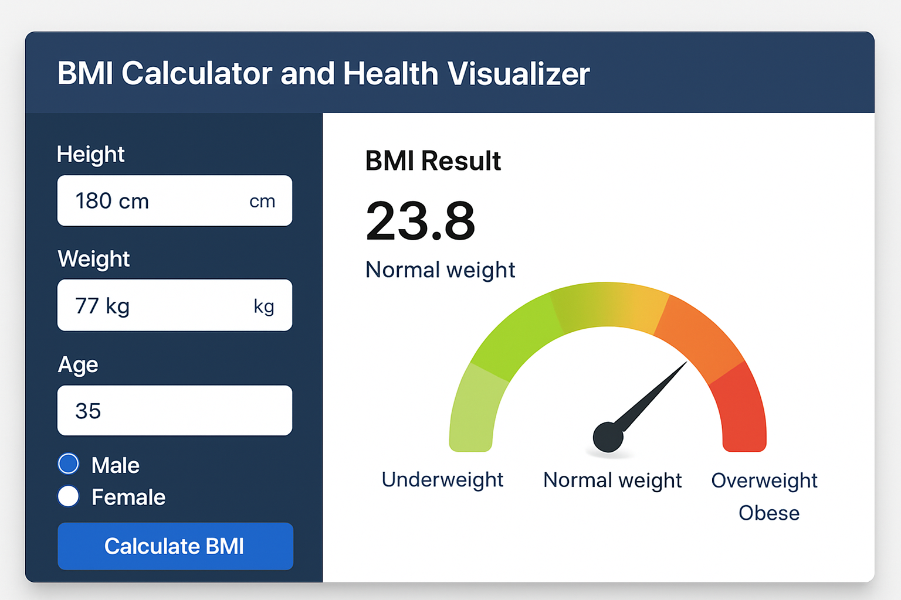
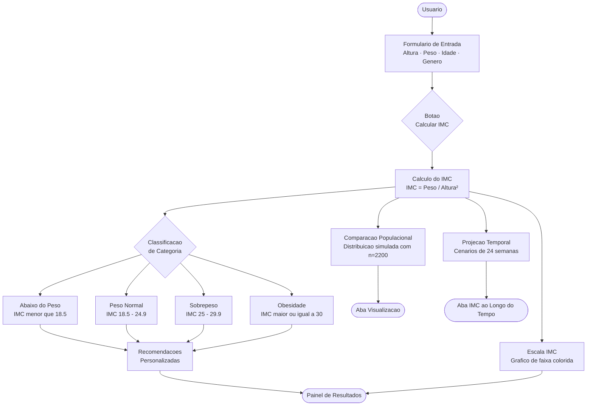
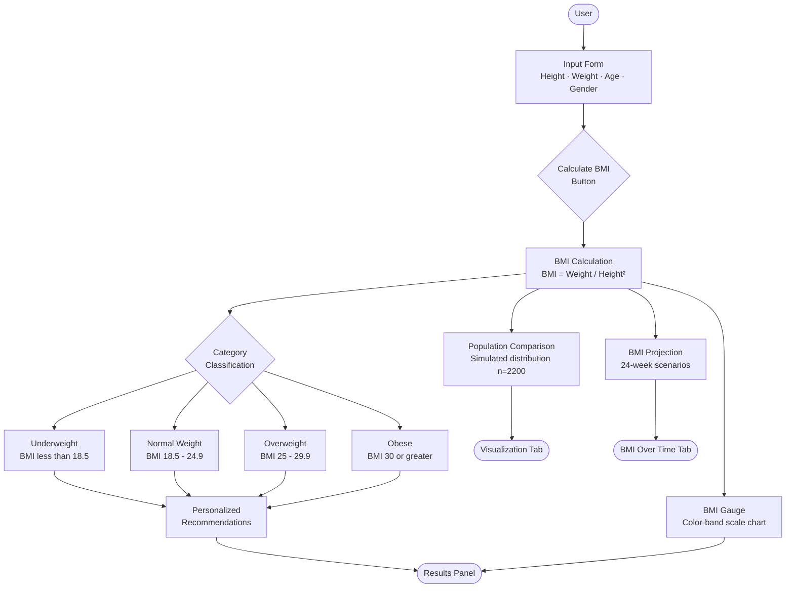

# BMI Calculator e Visualizador de Saude / BMI Calculator and Health Visualizer



[](https://www.r-project.org/)
[](https://shiny.posit.co/)
[](https://ggplot2.tidyverse.org/)
[](LICENSE)

---

## Portugues (PT-BR)

### Visao Geral

Esse projeto nasceu de uma necessidade real: queria entender melhor como o IMC se comporta visualmente, nao apenas como um numero solto. A aplicacao Shiny calcula o Indice de Massa Corporal (IMC) do usuario com base em altura, peso, idade e genero, e entrega tres visualizacoes interativas que colocam esse numero em contexto — uma escala comparativa, uma distribuicao populacional e uma projecao temporal de diferentes cenarios.

O repositorio tambem inclui uma apresentacao em 5 slides (R Markdown / ioslides) que explica a logica do app, adequada para entrega academica.

---

### Arquitetura do Aplicativo

O diagrama abaixo mostra o fluxo completo desde a entrada do usuario ate as saidas visuais:



---

### Funcionalidades

- **Calculo do IMC**: formula padrao da OMS — peso (kg) dividido pelo quadrado da altura (m)
- **Classificacao em 4 categorias**: Abaixo do Peso, Normal, Sobrepeso e Obesidade
- **Recomendacoes personalizadas**: sugestoes especificas por categoria, exibidas logo apos o calculo
- **Escala visual do IMC**: grafico de faixas coloridas com marcador na posicao do usuario
- **Comparacao com populacao simulada**: distribuicao de 2.200 individuos com histograma e curva de densidade
- **Projecao de 24 semanas**: tres cenarios — manter, perder 0,5 kg/semana ou ganhar 0,5 kg/semana

---

### Como Rodar Localmente

**1. Clone o repositorio:**

```bash
git clone https://github.com/galafis/Course-Project-Shiny-Application-and-Reproducible-Pitch.git
```

**2. Instale os pacotes necessarios (se ainda nao tiver):**

```r
install.packages(c("shiny", "ggplot2"))
```

**3. Execute o aplicativo:**

```r
shiny::runApp("app")
```

**4. Como usar o app:**

1. Informe sua altura em centimetros
2. Informe seu peso em quilogramas
3. Ajuste a idade no slider
4. Selecione o genero
5. Clique em **"Calculate BMI"**
6. Explore as tres abas de resultado e visualizacao

---

### Apresentacao

Uma apresentacao de 5 slides em R Markdown / ioslides esta disponivel em `presentation/presentation.Rmd`. Para executar:

```r
rmarkdown::run("presentation/presentation.Rmd")
```

---

### Estrutura do Projeto

```
Course-Project-Shiny-Application-and-Reproducible-Pitch/
├── app/
│   ├── ui.R                # Interface do usuario (sidebarLayout + tabsetPanel)
│   └── server.R            # Logica do servidor, calculos e graficos ggplot2
├── presentation/
│   ├── presentation.Rmd    # Apresentacao em 5 slides (ioslides)
│   └── styles.css          # Estilos personalizados para a apresentacao
├── images/
│   ├── bmi_logo.png        # Logo do projeto
│   └── bmi_preview.png     # Preview para documentacao
└── README.md
```

---

## English

### Overview

This interactive Shiny application calculates the user's Body Mass Index (BMI) based on height, weight, age, and gender, and delivers three interactive visualizations to put that number in context: a color-coded BMI scale, a simulated population distribution, and a 24-week projection under three different weight scenarios.

The repository also includes a 5-slide reproducible pitch presentation (R Markdown / ioslides) suitable for academic submission.

---

### App Architecture

The diagram below shows the complete data flow from user input to visual outputs:



---

### Features

- **BMI Calculation**: WHO standard formula — weight (kg) divided by height squared (m)
- **4-category classification**: Underweight, Normal Weight, Overweight, Obese
- **Personalized recommendations**: category-specific health suggestions rendered immediately after calculation
- **BMI gauge visualization**: color-banded scale chart with a marker at the user's position
- **Population comparison**: simulated distribution of 2,200 individuals rendered as a histogram with density curve
- **24-week BMI projection**: three selectable scenarios — maintain, lose 0.5 kg/week, or gain 0.5 kg/week

---

### Understanding BMI

Body Mass Index (BMI) is a screening tool used to identify weight categories that may be associated with health risks. It is calculated as:

```
BMI = weight (kg) / height (m)²
```

| Category      | BMI Range         |
|---------------|-------------------|
| Underweight   | Less than 18.5    |
| Normal weight | 18.5 to 24.9      |
| Overweight    | 25.0 to 29.9      |
| Obese         | 30.0 or greater   |

> **Note**: BMI is a population-level screening tool and does not account for muscle mass, bone density, or fat distribution. Always consult a healthcare professional for personalized medical advice.

---

### Running the App Locally

**1. Clone the repository:**

```bash
git clone https://github.com/galafis/Course-Project-Shiny-Application-and-Reproducible-Pitch.git
```

**2. Install required packages:**

```r
install.packages(c("shiny", "ggplot2"))
```

**3. Launch the app:**

```r
shiny::runApp("app")
```

**4. Using the app:**

1. Enter your height in centimeters
2. Enter your weight in kilograms
3. Select your age using the slider
4. Choose your gender
5. Click **"Calculate BMI"**
6. View your results and explore the three visualization tabs

---

### Presentation

A 5-slide reproducible pitch presentation is available in the `presentation/` folder. It covers:

1. Purpose and features of the BMI Calculator
2. How BMI is calculated and its categories
3. Interactive features of the application
4. Sample visualizations from the app
5. How to access and run the application

To view the presentation:

```r
rmarkdown::run("presentation/presentation.Rmd")
```

---

### Technical Stack

| Component    | Technology              |
|--------------|-------------------------|
| Language     | R                       |
| Web Framework| Shiny                   |
| Visualization| ggplot2                 |
| Presentation | R Markdown + ioslides   |
| Styling      | Custom CSS              |

---

### Project Structure

```
Course-Project-Shiny-Application-and-Reproducible-Pitch/
├── app/
│   ├── ui.R                # User interface (sidebarLayout + tabsetPanel)
│   └── server.R            # Server logic, calculations, and ggplot2 charts
├── presentation/
│   ├── presentation.Rmd    # 5-slide ioslides pitch presentation
│   └── styles.css          # Custom presentation styles
├── images/
│   ├── bmi_logo.png        # Project logo
│   └── bmi_preview.png     # Preview screenshot for documentation
└── README.md
```

---

### Future Enhancements

- Additional health metrics beyond BMI (body fat percentage, waist-to-height ratio)
- Data persistence to track BMI changes over time
- PDF/CSV export functionality for health reports
- Mobile-responsive layout improvements

---

## License

This project is licensed under the MIT License. See the [LICENSE](LICENSE) file for details.

---

*Created by Gabriel Demetrios Lafis — May 28, 2025*
